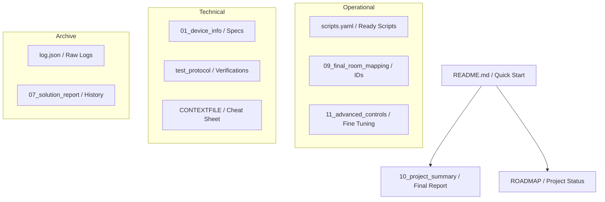

# 🗂 Документация Xiaomi Robot Vacuum T12 (b106bk)

Этот проект содержит полную информацию по интеграции...

## 🟢 Уровень 1: Точка входа (Quick Start)
*   **[README.md](./README.md)** — Основной файл. Установка плагинов и базовый запуск.
*   **[10_project_summary_2026_02_08.md](./10_project_summary_2026_02_08.md)** — **ИТОГОВЫЙ ОТЧЕТ**. Техническое решение и краткая выжимка.
*   **[ROADMAP](./ROADMAP)** — Статус проекта и план выполненных работ.

## 🔵 Уровень 2: Эксплуатация (Operational)
*   **[scripts.yaml](./scripts.yaml)** — Готовые скрипты для Home Assistant.
*   **[09_final_room_mapping.md](./09_final_room_mapping.md)** — Подтвержденные ID комнат.
*   **[11_advanced_controls.md](./11_advanced_controls.md)** — Управление мощностью, водой и маршрутами.

## 🟡 Уровень 3: Технические детали (Technical)
*   **[01_device_info.md](./01_device_info.md)** — Спецификация устройства и сетевые параметры.
*   **[test_protocol_20260208.md](./test_protocol_20260208.md)** — Протокол верификации всех команд.
*   **[CONTEXTFILE](./CONTEXTFILE)** — Шпаргалка по MIoT командам.

## ⚪️ Уровень 4: Архив и История (Archive)
*   **[log.json](./log.json)** — Сырые логи обмена данными.
*   **[07_solution_report.md](./07_solution_report.md)** — Отчет о нахождении рабочего решения.
*   **[История процесса]**:
    *   [02_current_status.md](./02_current_status.md) — Исходное состояние.
    *   [03_working_scripts.md](./03_working_scripts.md) — Промежуточные скрипты.
    *   [04_room_cleaning_attempts.md](./04_room_cleaning_attempts.md) — Неудачные попытки.
    *   [06_next_steps.md](./06_next_steps.md) — Рабочий план (устарело).
    *   [08_final_success.md](./08_final_success.md) — Момент фиксации успеха.

---
**Последнее обновление:** 2026-02-08
**Статус:** ✅ Верифицировано