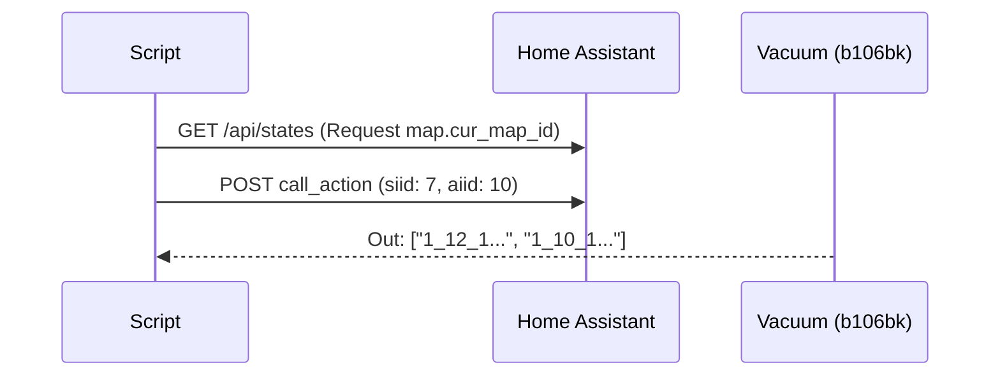

# 🛠 Руководство разработчика (Developer Guide)

Данный документ содержит технические подробности протокола MIoT для модели `xiaomi.vacuum.b106bk` и инструкции по воспроизведению управляющих запросов.

## 🔑 Основы взаимодействия

Взаимодействие с устройством происходит через Home Assistant API и интеграцию `xiaomi_miot`.

- **Endpoint:** `http://<HASS_HOST>:8123/api/services/xiaomi_miot/<service_name>`
- **Auth:** Bearer Token в заголовке `Authorization`.

## 📋 Карта MIoT идентификаторов

| Функция | SIID | PIID / AIID | Тип | Значения |
|---------|------|-------------|-----|----------|
| **Room Cleaning** | 7 | 3 (Action) | Start | `["ID", 0, 1]` |
| **Stop Vacuum** | 2 | 2 (Action) | Stop | - |
| **Get Room IDs** | 7 | 10 (Action) | Info | Input: `[map_id]` |
| **Suction Power** | 7 | 5 (Prop) | Set | 0-Silent, 1-Std, 2-Med, 3-Turbo |
| **Water Level** | 7 | 6 (Prop) | Set | 0-Low, 1-Mid, 2-High |
| **Cleaning Mode** | 2 | 4 (Prop) | Set | 0-Vacuum, 1-V&M, 2-Mop |

## 🔄 Алгоритмы обнаружения комнат

### 1. Пассивное (Action 7,10)
Запрос списка ID из кэша пылесоса. Процедура:


### 2. Активное сканирование (Bruteforce)
Применяется при пустом ответе от пассивного метода.
- **Логика**: Перебор ID 10-20. Для каждого ID отправляется `siid: 7, aiid: 3` (Start).
- **Ожидание**: Скрипт ждет N секунд (задается пользователем, 5-120), чтобы пылесос успел отъехать от базы и стать заметным в нужной комнате.
- **Принятие решения**: Если пылесос поехал — ID рабочий. Пользователь вводит имя.
- **Сброс**: После каждого ID отправляется `stop` (`siid: 2, aiid: 2`), чтобы вернуть пылесос в готовность.

## 🚀 Ручное управление (CURL)

### Старт уборки комнаты 11
```bash
curl -X POST http://localhost:8123/api/services/xiaomi_miot/call_action 
  -H "Authorization: Bearer <TOKEN>" 
  -H "Content-Type: application/json" 
  -d '{
    "entity_id": "vacuum.xiaomi_b106bk_807e_robot_cleaner",
    "siid": 7,
    "aiid": 3,
    "params": ["11", 0, 1]
  }'
```

## 🚀 Деплой (Deployment)

Скрипт `setup_vacuum.py` поддерживает автоматический перенос настроек в Home Assistant.
Параметры в `.env`:
- `DEPLOY_TYPE`: 
    - `docker`: Для HA, запущенного в Docker. Путь должен вести к примонтированному файлу `scripts.yaml`.
    - `native`: Для классической установки HA.
    - `disable`: Только генерация локального файла.
- `DEPLOY_PATH`: Абсолютный путь к целевому файлу `scripts.yaml`.

При успешном деплое скрипт:
1. Создает резервную копию `scripts.yaml.bak`.
2. Добавляет новые скрипты в конец файла.
3. Вызывает `curl -X POST .../api/services/script/reload` для горячего применения.
