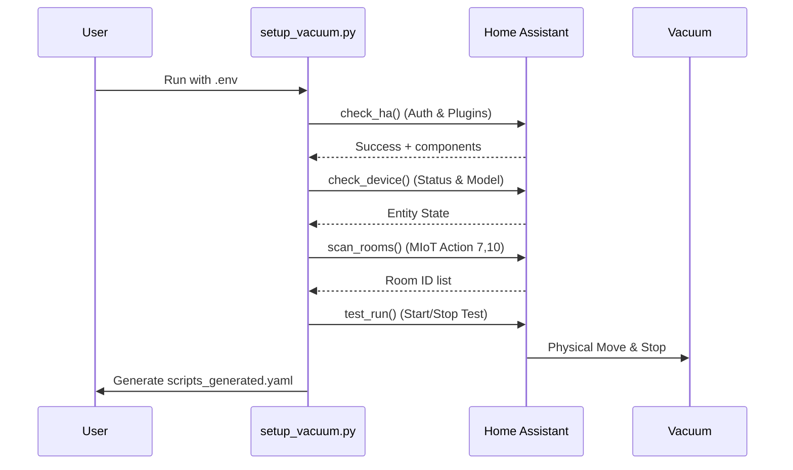
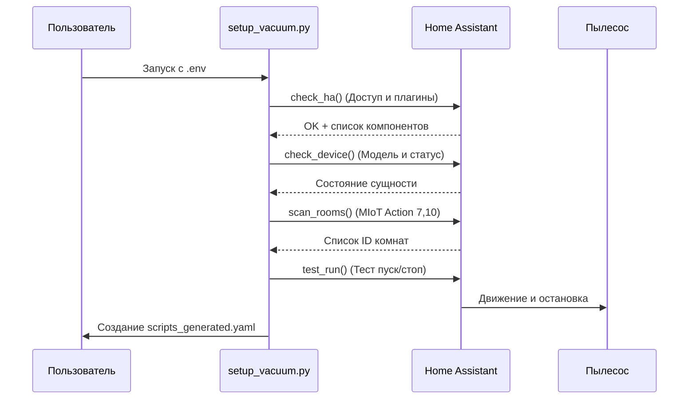

# Xiaomi Robot Vacuum T12 (b106bk) Home Assistant Setup

**Model:** Xiaomi Robot Vacuum T12
**Technical ID:** `xiaomi.vacuum.b106bk`
**Firmware:** 4.3.3_0010
**Last Updated:** 2026-02-08

---

## 🇬🇧 English Documentation

### 🛠 Prerequisites
1.  **HACS** (Home Assistant Community Store).
2.  **Xiaomi Miot Auto** integration (available via HACS).

### 🚀 Automation Setup (Recommended)
Use the `setup_vacuum.py` script to automate diagnostics and script generation.



**How to use:**
1. Copy `.env_example` to `.env` and fill in your Token and IP.
2. Run `python3 setup_vacuum.py`.
3. The script will verify your setup and generate `scripts_generated.yaml`.

### ✅ The Solution
To clean specific rooms, use **Service 7 (Sweep)** and **Action 3 (set-room-clean)**.

```yaml
service: xiaomi_miot.call_action
data:
  entity_id: vacuum.xiaomi_b106bk_807e_robot_cleaner
  siid: 7
  aiid: 3
  params: ["ROOM_ID", 0, 1]
```

### 🏠 Room Mapping (For this device)
| ID | Name | Status |
|----|------|--------|
| **10** | 🧸 Nursery | Confirmed |
| **11** | 🍳 Kitchen | Confirmed |
| **12** | 🛏️ Bedroom | Confirmed |
| **13** | 🚶 Corridor | Confirmed |

---

## 🇷🇺 Русская документация

### 🛠 Требования
1.  **HACS** (Home Assistant Community Store).
2.  **Xiaomi Miot Auto** (устанавливается через HACS).

### 🚀 Автоматическая настройка
Используйте скрипт `setup_vacuum.py` для автоматической диагностики и генерации скриптов.



**Инструкция:**
1. Скопируйте `.env_example` в `.env` и укажите ваш Токен и IP.
2. Запустите `python3 setup_vacuum.py`.
3. Скрипт проверит систему и создаст готовый файл `scripts_generated.yaml`.

### ✅ Техническое решение
Для уборки комнат используйте **Service 7 (Sweep)** и **Action 3 (set-room-clean)**.

```yaml
service: xiaomi_miot.call_action
data:
  entity_id: vacuum.xiaomi_b106bk_807e_robot_cleaner
  siid: 7
  aiid: 3
  params: ["ID_КОМНАТЫ", 0, 1]
```

### 🗣 Интеграция с Алисой
1. Сгенерированные скрипты автоматически добавятся в ваш HA.
2. В приложении **"Дом с Алисой"** обновите список устройств.
3. Создайте сценарии (например, "Алиса, убери в спальне"), выбрав соответствующий скрипт.

---

## 📋 Proven Working Methods (Verified 2026-02-08)
- **Room Clean**: `siid: 7, aiid: 3`
- **Global Stop**: `siid: 2, aiid: 2`
- **Settings**: `xiaomi_miot.set_miot_property` (siid 7, piid 5/6)