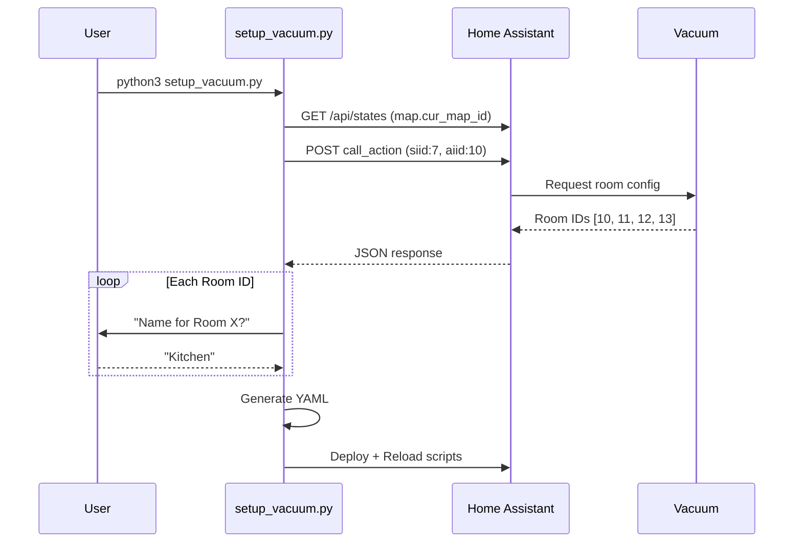

# Xiaomi Robot Vacuum T12 (b106bk) Home Assistant Setup

[]()
[]()
[]()

**Last Updated:** 2026-02-09

---

## Table of Contents / Оглавление

- [Quick Start (EN)](#-quick-start)
- [Быстрый старт (RU)](#-быстрый-старт)
- [Configuration / Конфигурация](#-configuration--конфигурация)
- [Room Mapping / Карта комнат](#-room-mapping--карта-комнат)
- [Advanced Settings / Расширенные настройки](#-advanced-settings--расширенные-настройки)
- [Yandex Alice Integration](#-yandex-alice-integration--интеграция-с-алисой)
- [Troubleshooting / Решение проблем](#-troubleshooting--решение-проблем)
- [Technical Reference](#-technical-reference)

---

## Quick Start

```bash
# 1. Clone and configure
cp .env_example .env
nano .env  # Set HASS_HOST, HASS_TOKEN, ENTITY_ID

# 2. Run setup wizard
python3 setup_vacuum.py

# 3. Done! Scripts are deployed to Home Assistant
```

**Prerequisites:**
- [HACS](https://hacs.xyz/) installed
- [Xiaomi Miot Auto](https://github.com/al-one/hass-xiaomi-miot) integration via HACS

---

## Быстрый старт

```bash
# 1. Клонируйте и настройте
cp .env_example .env
nano .env  # Укажите HASS_HOST, HASS_TOKEN, ENTITY_ID

# 2. Запустите мастер настройки
python3 setup_vacuum.py

# 3. Готово! Скрипты добавлены в Home Assistant
```

**Требования:**
- Установленный [HACS](https://hacs.xyz/)
- Интеграция [Xiaomi Miot Auto](https://github.com/al-one/hass-xiaomi-miot) через HACS

---

## Configuration / Конфигурация

Copy `.env_example` to `.env` and fill in the values:

| Variable | Description | Example |
|----------|-------------|---------|
| `HASS_HOST` | Home Assistant IP address | `192.168.1.100` |
| `HASS_TOKEN` | Long-lived access token ([how to get](https://developers.home-assistant.io/docs/auth_api/#long-lived-access-token)) | `eyJ0eXAiOi...` |
| `ENTITY_ID` | Vacuum entity ID from HA | `vacuum.xiaomi_b106bk_807e_robot_cleaner` |
| `DEPLOY_TYPE` | Deployment method | `docker` / `native` / `disable` |
| `DEPLOY_PATH` | Path to scripts.yaml | `/config/scripts.yaml` |

**DEPLOY_TYPE options:**
- `docker` - Appends to `scripts.yaml` in Docker volume
- `native` - Appends to local filesystem path  
- `disable` - Only generates `scripts_generated.yaml` (manual copy)

---

## Room Mapping / Карта комнат

| ID | Room / Комната | Status |
|----|----------------|--------|
| **10** | Nursery / Детская | Verified |
| **11** | Kitchen / Кухня | Verified |
| **12** | Bedroom / Спальня | Verified |
| **13** | Corridor / Коридор | Verified |

**Note:** Room IDs are unique to your device. Run `setup_vacuum.py` to discover yours.

---

## How It Works / Как это работает



---

## Advanced Settings / Расширенные настройки

### Suction Power / Мощность всасывания

```yaml
service: xiaomi_miot.set_miot_property
data:
  entity_id: vacuum.xiaomi_b106bk_807e_robot_cleaner
  siid: 7
  piid: 5
  value: 3  # 0=Silent, 1=Standard, 2=Medium, 3=Turbo
```

### Water Level / Уровень воды

```yaml
service: xiaomi_miot.set_miot_property
data:
  entity_id: vacuum.xiaomi_b106bk_807e_robot_cleaner
  siid: 7
  piid: 6
  value: 2  # 0=Low, 1=Medium, 2=High
```

### Cleaning Mode / Режим уборки

```yaml
service: xiaomi_miot.set_miot_property
data:
  entity_id: vacuum.xiaomi_b106bk_807e_robot_cleaner
  siid: 2
  piid: 4
  value: 1  # 0=Vacuum, 1=Vacuum+Mop, 2=Mop only
```

See [DEVELOPER.md](./DEVELOPER.md) for full MIoT protocol reference.

---

## Yandex Alice Integration / Интеграция с Алисой

1. Generated scripts appear as entities in Home Assistant
2. In **"Дом с Алисой"** app, refresh device list
3. Create scenarios:
   - "Алиса, убери в спальне" -> `script.vacuum_clean_bedroom`
   - "Алиса, останови пылесос" -> `script.vacuum_stop`

---

## Troubleshooting / Решение проблем

### Connection Error / Ошибка подключения

```
❌ No connection to Home Assistant
```

**Solution:** Check `.env` values:
- Verify `HASS_HOST` is reachable: `ping <IP>`
- Verify token is valid (not expired)
- Ensure HA is running on port 8123

### Room IDs Not Found / ID комнат не найдены

**Solution 1:** Use VEVS logs from Mi Home app. Look for `get-preference-ii` response:
```json
{"result":{"out":["[\"1_12_1_3_2_1_1_0\",\"1_10_1_3_2_1_1_1\"]"]}}
```
The numbers after `1_` are room IDs (12, 10).

**Solution 2:** Use active scanning (bruteforce IDs 10-20).

### Vacuum Doesn't Move / Пылесос не едет

- Check if vacuum is on charging dock
- Verify `ENTITY_ID` matches your device in HA
- Check HA logs: Settings -> System -> Logs

---

## Technical Reference

### Core Commands (Verified)

| Function | Service | SIID | AIID | Params |
|----------|---------|------|------|--------|
| Clean Room | `call_action` | 7 | 3 | `["ID", 0, 1]` |
| Stop | `call_action` | 2 | 2 | - |
| Get Room IDs | `call_action` | 7 | 10 | `[map_id]` |

### Example: Clean Kitchen (Room 11)

```yaml
service: xiaomi_miot.call_action
data:
  entity_id: vacuum.xiaomi_b106bk_807e_robot_cleaner
  siid: 7
  aiid: 3
  params: ["11", 0, 1]
```

---

## Project Files / Файлы проекта

| File | Description |
|------|-------------|
| [setup_vacuum.py](./setup_vacuum.py) | Interactive setup wizard |
| [scripts.yaml](./scripts.yaml) | Ready-to-use HA scripts |
| [DEVELOPER.md](./DEVELOPER.md) | Full MIoT protocol docs |
| [CONTEXTFILE](./CONTEXTFILE) | Quick command reference |

---

**License:** MIT | **Verified:** 2026-02-08 | **Model:** xiaomi.vacuum.b106bk
